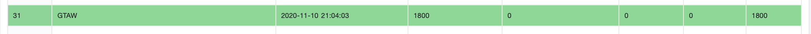
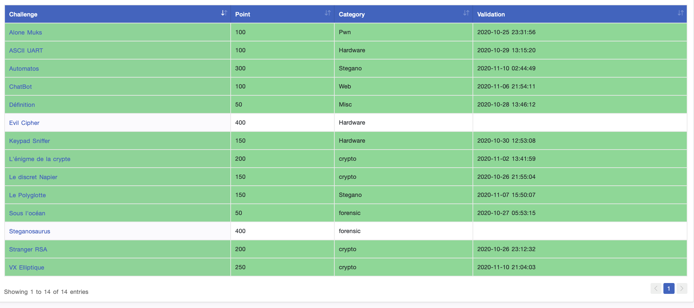

# Brigitte Friang

En 2020, la DGSE avec l'ESIEE propose le [Challenge Brigitte Friang](https://www.defense.gouv.fr/dgse/tout-le-site/operation-brigitte-friang-prets-pour-relever-le-defi).

Le challenge se déroule en trois phases:
1. La [page web](https://challengecybersec.fr/) du challenge et une petite énigme facile, qui permet d'accéder aux 4 défis.
2. 4 [défis](https://challengecybersec.fr/chat) de crypto, web, algo, forensic. Chaque défi réalisable indépendamment l'un de l'autre débloque l'accès aux CTF.
3. 14 [challenges](https://ctf.challengecybersec.fr/7a144cdc500b28e80cf760d60aca2ed3/) du type *Capture The Flag*. Les CTF sont indépendants, nécessitent la création d'une *team*, il y a un *ranking* mis en place.

## Write-up

| Challenge  | Catégorie | Points  | Description |
| ---------- | --------- | ------- | ------------ |
| [intro](etape1/README.md) | intro | | Introduction au Challenge Brigitte Friang |
| [Antoine Rossignol](etape2/crypto/README.md) | crypto | | Challenge d'Antoine Rossignol du service Crypto |
| [Alphonse Bertillon](etape2/forensic/README.md) | forensic | | Challenge d'Alphonse Bertillon du Service Forensic |
| [Alone Muks](ctf/Alone_Musk/README.md) | Pwn | 100 | élevation de privilèges |
| [ASCII UART](ctf/ASCII_UART/README.md) | Hardware | 100 | |
| [Automatos](ctf/Automatos/README.md) | Stegano | 300 | observation du rouge |
| [ChatBot](ctf/ChatBot/README.md) | Web | 100 | intrusion intranet |
| [Définition](ctf/Définition/README.md) | Misc | 50 | UNIX |
| [Keypad Sniffer](ctf/Keypad_Sniffer/README.md) | Hardware | 100 | |
| [L'énigme de la crypte](ctf/L_énigme_de_la_crypte/README.md) | crypto | 200 | AES et Enigma |
| [Le discret Napier](ctf/Le_discret_Napier/README.md) | crypto | 150 | logarithme discret |
| [Le Polyglotte](ctf/Le_Polyglotte/README.md) | Stegano | 150 | fichiers trafiqués, Blowfish, reverse |
| [Sous l'océan](ctf/Sous_l_océan/README.md) | forensic | 50 | recherche dans fichier |
| [Stranger RSA](ctf/Stranger_RSA/README.md) | crypto | 200 | RSA |
| [VX Elliptique](ctf/VX_Elliptique/README.md) | crypto | 250 | (Sage)Math |

## Présentation sur le site de la DGSE

### Opération « Brigitte Friang », prêts pour relever le défi ?

Mise à jour  : 23/10/2020 - Direction : DGSE

*Le nouveau challenge de cybersécurité de la DGSE se déroulera, en ligne, du samedi 24 octobre au mercredi 11 novembre 2020.*

Après le succès d’une première édition en 2019, intitulée Challenge Richelieu, c’est à Brigitte Friang, résistante et membre du BCRA (le service de renseignements français durant la Seconde Guerre mondiale), d’être mise à l’honneur cette année.

La DGSE et l’école de l’innovation technologique (ESIEE Paris) proposent aux internautes d’incarner durant plus de deux semaines l’agent 42 afin de déjouer une attaque menaçant les ressortissants et les intérêts français suite à une révolte dans un pays fictif. L’opération Brigitte Friang est lancée!

Ce challenge a pour but de faire découvrir à un large public (du lycéen à l’expert) les métiers techniques de la DGSE en proposant des défis de difficulté progressive organisés en deux parties.
Une première phase déclinée en trois domaines :  la cryptographie, le web et l’algorithmique. Elle permet à toutes et à tous, quel que soit son domaine de prédilection de participer au challenge.
Une fois les premières épreuves résolues, la seconde phase débute sous la forme d’une plateforme de type CTF (mode de jeu par équipe). Cette dernière proposera des challenges variés jusqu’au niveau expert. Chaque résolution d’étape rapporte un certain nombre de points. Le classement sera visible en temps réel sur la plateforme.

Pour relever le défi, rendez-vous dès le 24 octobre sur [www.challengecybersec.fr](https://www.challengecybersec.fr/)

Sources : DGSE 
Droits : DGSE

## Ranking final

Le challenge a été réalisé en équipe. Nous avons terminé 31e avec 1800 points. Il manquait deux challenges à résoudre.

L'ensemble des write-up sélectionnés est disponible ici: https://challenge-friang.gitbook.io/challenge-brigitte-friang/, dont le mien autour d'Enigma: [Enigme de la Crypte](https://challenge-friang.gitbook.io/challenge-brigitte-friang/coros-ctf/enigme-de-la-crypte)

