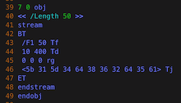
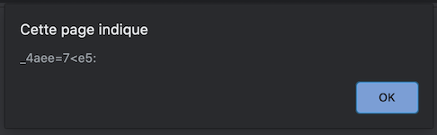

# Le Polyglotte

[Lien](https://ctf.challengecybersec.fr/7a144cdc500b28e80cf760d60aca2ed3/challenge-detail.php?chall=32)

Category : Stegano

Points : 150

## Description
Nous avons intercepté un fichier top secret émanant d'Evil Country, il est très certainement en rapport avec leur programme nucléaire. Personne n'arrive à lire son contenu.

Pouvez-vous le faire pour nous ? Une archive était dans le même dossier, elle peut vous servir

Le flag est de la forme : DGSESIEE{x} avec x un hash que vous trouverez

* message.pdf (SHA256=e5aa5c189d3f3397965238fbef5bc02c889de6d5eac713630e87377a5683967c) : http://challengecybersec.fr/d3d2bf6b74ec26fdb57f76171c36c8fa/message.pdf
* secrets.zip (SHA256=ae5877bb06ac9af5ad92c8cd40cd15785cbc7377c629ed8ec7443f251eeca91f) : http://challengecybersec.fr/d3d2bf6b74ec26fdb57f76171c36c8fa/secrets.zip


## Solution

Le titre du challenge évoque vraisemblablement la technique d'imbrication de fichiers de formats différents telle qu'elle a été décrite lors d'une conférence [SSTIC 2013](https://www.sstic.org/media/SSTIC2013/SSTIC-actes/polyglottes_binaires_et_implications/SSTIC2013-Article-polyglottes_binaires_et_implications-albertini.pdf).

### Le document PDF

A la lecture de l'énoncé du challenge, `message.pdf` est *de facto* le fichier qui semble le plus intéressant.

Généralement, il est de bon ton de ne pas ouvrir directement un .pdf suspect avec un lecteur, mais `a minima` avec un éditeur de texte comme [vim](https://www.vim.org) ou [hexdump](https://man7.org/linux/man-pages/man1/hexdump.1.html).

On remarque de suite qu'il n'est pas « normal «. L'entête n'est pas au tout début du fichier (il y a un `<`en trop), il y a du code HTML et un bloc binaire obscur à la fin en dehors des objets PDF. D'ailleurs, il peut s'ouvrir avec un navigateur web, comme Firefox.

Pour rappel, les PDF sont constitués (format [PDF 1.4](https://www.adobe.com/content/dam/acom/en/devnet/pdf/pdfs/pdf_reference_archives/PDFReference.pdf)):
- d'un entête `%PDF-1.𝑥` (soit au début, soit dans les 1024 premiers octets selon le logiciel)
- d'objets (`𝒏 0 obj … endobj`)
- d'un trailer (`trailer<<…>>`)

En dépit de cela, il peut s'afficher plus ou moins bien selon le du lecteur PDF utilisé et son degré de laxisme. Mais ça ne nous intéresse pas ici.

#### Les textes

Les objets contiennent plusieurs types de données, et on remarque rapidement des suites d'octets en hexadécimal. Cela tombe bien, ces suites sont dans des sections `BT … ET` (*Begin text* … *End text*). De plus, il y a la commande `Tj` (*Text showing*) qui demande l'affichage.



Quelques lignes de Python décodent rapidement ces textes:
```python
#!/usr/bin/env python3

from pathlib import Path
import re

# chargement du fichier
pdf = Path("message.pdf").read_bytes()

# recherche des textes <hexa hexa....> Tj
print("Info dans pdf:")
for m in re.findall(rb"<((?:[0-9a-f]{2} ?)+)> Tj", pdf):
    t = "".join(map(lambda x: chr(int(x, 16)), m.decode().split()))
    print(t)
    print()
```

Deux objets PDF contiennent du texte de cette manière, en plus de « Top Secret ».

##### objet 9

Le texte se décode ainsi:
```
Ce document concerne l operation soleil atomique.
Cette operation est strictement confidentielle et ne doit en aucun cas être devoilee. Les informations sur l operation sont disseminées dans ce fichier.
Chaque partie de l information est identifiee par un nombre par ex :
[0]ae7bca8e correspond a la première partie de l information qu il faut concatener au reste.
```

C'est en quelque sorte le « mode d'emploi » du document et le but du challenge: il faut rechercher des textes du genre `[𝒏]1234abcd`.

##### objet 7

Le décodage donne:
```
[1]4d862d5a
```

C'est donc la deuxième partie du flag.

Pas d'autre texte, il est temps d'analyser le HTML.


#### Partie HTML

Là aussi, pas de nécessité d'ouvrir le HTML dans un navigateur, le code JavaScript est très simple. Il y en a une partie au début et la suite un peu plus bas. Le script affiche dans une *popup* un texte à partir du code [ASCII](https://fr.wikibooks.org/wiki/Les_ASCII_de_0_à_127/La_table_ASCII) des caractères.




```html
<script>var flag = [91,48,93,97,97,57,51,56,97,49,54];</script>
<script>for(i=0;i<flag.length;i++){flag[i] = flag[i]+4} alert(String.fromCharCode.apply(String, flag));</script>
```

Python au travail:
```python
# zone HTML
print("Info dans page html:")
m = re.search(rb"flag = \[((?:\d{2},?)+)\]", pdf)
m = m.group(1)
t = "".join(map(chr, map(int, m.decode().split(","))))
print(t)
print()
```

Et on obtient:
```
[0]aa938a16
```

C'est donc la première partie du flag. Le `+4` ne sert à rien d'autre que perturber la compréhension.

Pas d'indication pour décoder le bloc binaire, il faut à présent exploiter les informations de l'archive `secrets.zip`.


### L'archive secrets.zip

L'archive est protégée par mot de passe. Toute tentative de trouver le mot de passe à partir de `message.pdf` échoue (les portions du flag, Top Secret, etc.).

Et si le mot de passe était crackable ? On va utiliser [frackzip](http://manpages.ubuntu.com/manpages/trusty/man1/fcrackzip.1.html) et le dictionnaire `rockyou.txt` (dictionnaire souvent utilisé pour les CTF).

```bash
fcrackzip secrets.zip -D -p rockyou.txt -u
unzip -P finenuke secrets.zip
```

Le fichier `info.txt` contient la quatrième partie du flag:
```
[3]4037402d4
```
et le nom [Ange Albertini](https://github.com/corkami) connu justement pour ses fichiers polyglottes, et un couple Key,IV. La clé fait 16 octets, et l'IV 8 octets.


`hint.png` est « juste » le dessin d'un [poisson-globe](https://fr.wikipedia.org/wiki/Poisson-globe), appelé *blowfish* en anglais. Quelques recherches sur de la stégano dans le fichier restent infructueuses. Le *hint* est juste [Blowfish](https://fr.wikipedia.org/wiki/Blowfish).


On va donc appliquer le chiffrage Blowfish à `message.pdf`. Après quelques tâtonnements, on trouve la bonne combinaison:
```python
#!/usr/bin/env python3

from Crypto.Cipher import AES, DES3, Blowfish
from pathlib import Path

key = b"\xce]`^+5w#\x96\xbbsa\x14\xa7\x0ei"
iv = b"\xc4\xa7\x1e\xa6\xc7\xe0\xfc\x82"

enc = Blowfish.new(key, Blowfish.MODE_CBC, iv)
Path(f"nuke.jpg").write_bytes(enc.encrypt(Path("message.pdf").read_bytes()))
```

Le fichier `message.pdf` déchiffré avec l'algorithme Blowfish donne donc une JPEG !


### L'image nuke.jpg

De même que le PDF, l'image ne s'ouvre pas avec tous les logiciels: elle a été trafiquée. C'est justement le processus [Angecryption](http://repository.root-me.org/Stéganographie/EN%20-%2031C3%20-%20Funky%20File%20Formats%20-%20Ange%20Albertini.pdf) d'Ange Albertini qui permet de masquer des documents dans d'autres moyennant un chiffrage AES, Blowfish, TripleDES, etc.


Cependant, une analyse rapide avec `strings` montre qu'il ne faut pas chercher dans le JPEG: il y a autre chose accroché à l'image, et en l'occurence c'est un binaire ELF.

```bash
root:/work$ strings nuke.jpg | tail -100
✂︎
Operation Soleil Atomique
Entrez le mot de passe :
Bravo
Mauvais mot de passe
✂︎
.data
.bss
.comment
root:/work$ binwalk nuke.jpg

DECIMAL       HEXADECIMAL     DESCRIPTION
--------------------------------------------------------------------------------
72613         0x11BA5         ELF, 64-bit LSB shared object, AMD x86-64, version 1 (SYSV)

root:/work$ dd if=nuke.jpg of=nuke.bin bs=72613 skip=1
✂︎
root:/work$ file nuke.bin
nuke.bin: ELF 64-bit LSB shared object, x86-64, version 1 (SYSV), dynamically linked, interpreter /lib64/ld-linux-x86-64.so.2, BuildID[sha1]=dc9ae4a3811cf6a4acd62a1a5ab812bfd81fbe8d, for GNU/Linux 3.2.0, not stripped
root:/work$ ldd nuke.bin
	linux-vdso.so.1 (0x00007ffddedea000)
	libc.so.6 => /lib/x86_64-linux-gnu/libc.so.6 (0x00007f6454054000)
	/lib64/ld-linux-x86-64.so.2 (0x00007f645422a000)
```

L'intuition (plus le contexte et la difficuté relative du challenge) permet de penser raisonnablement que le programme a été écrit en C. Il y a les symboles, donc il se décompilera bien.

Un petit coup de [Ghidra](https://ghidra-sre.org) et on obtient une fonction `main` au contenu explicite et lisible. Un petit travail de renommage et de typage, et on obtient un code parfaitement compilable: [nuke.c](.//nuke.c).

Nota: le programme a été compilé avec l'option `-fstack-protector` pour activer le [SSP](https://fr.wikipedia.org/wiki/Stack-Smashing_Protector).

```cpp
int main(void)
{
  size_t len;
  byte *password;
  long in_FS_OFFSET;
  char buffer [24];
  long canary;

  canary = *(long *)(in_FS_OFFSET + 0x28);
  puts("Operation Soleil Atomique");
  printf("Entrez le mot de passe : ");
  fgets(buffer,0x10,stdin);
  len = strlen(buffer);
  password = (byte *)malloc(len + 1);
  strcpy((char *)password,buffer);
  checkpassword((char *)password);
  if (((((((password[1] ^ *password) == 0x69) && ((password[2] ^ password[1]) == 0x6f)) &&
        ((password[3] ^ password[2]) == 0x38)) &&
       (((password[4] ^ password[3]) == 0x56 && ((password[5] ^ password[4]) == 0x50)))) &&
      (((password[6] ^ password[5]) == 0x57 &&
       (((password[7] ^ password[6]) == 0x50 && ((password[8] ^ password[7]) == 0x56)))))) &&
     (((password[9] ^ password[8]) == 6 && (password[9] == 0x34)))) {
    puts("Bravo");
                    /* WARNING: Subroutine does not return */
    exit(0);
  }
  puts("Mauvais mot de passe");
  if (canary != *(long *)(in_FS_OFFSET + 0x28)) {
                    /* WARNING: Subroutine does not return */
    __stack_chk_fail();
  }
  return 0;
}
```


```cpp
int checkpassword(char *param_1)
{
  long in_FS_OFFSET;
  int i;
  uint local_78 [12];
  uint local_48 [14];
  long canary;

  canary = *(long *)(in_FS_OFFSET + 0x28);
  local_78[0] = 2;
  local_78[1] = 4;
  local_78[2] = 9;
  local_78[3] = 0xc;
  local_78[4] = 1;
  local_78[5] = 2;
  local_78[6] = 9;
  local_78[7] = 3;
  local_78[8] = 2;
  local_78[9] = 1;
  local_78[10] = 0xd;
  local_48[0] = 0x54;
  local_48[1] = 0x52;
  local_48[2] = 0x4f;
  local_48[3] = 0x4c;
  local_48[4] = 0x4f;
  local_48[5] = 0x4c;
  local_48[6] = 0x4f;
  local_48[7] = 0x4c;
  local_48[8] = 0x4f;
  local_48[9] = 0x4c;
  local_48[10] = 0x4f;
  i = 0;
  while (i < 0xb) {
    local_48[i] = local_48[i] ^ local_78[i];
    i = i + 1;
  }
  if (canary != *(long *)(in_FS_OFFSET + 0x28)) {
                    /* WARNING: Subroutine does not return */
    __stack_chk_fail();
  }
  return 0;
}
```


La fonction `checkpassword` ne fait rien avec le paramètre. Tant mieux. En sortie, la variable `local_78` contient les lettres `VVF@NNFOMMB`. C'était peut-être une tentative avortée de complexifier le challenge.

La vérification du `password` dans `main` est une série de comparaisons avec XOR entre caractères successifs en commençant par une comparaison entre `0x34` et le 10e caractère, soit `'4'`. En partant de la fin, on reconstruit la chaîne qui permet d'afficher le « Bravo ».

```python
#!/usr/bin/env python3

pwd = ""

c = 0x34
pwd = chr(c) + pwd
c = c ^ 6
pwd = chr(c) + pwd
c = c ^ 0x56
pwd = chr(c) + pwd
c = c ^ 0x50
pwd = chr(c) + pwd
c = c ^ 0x57
pwd = chr(c) + pwd
c = c ^ 0x50
pwd = chr(c) + pwd
c = c ^ 0x56
pwd = chr(c) + pwd
c = c ^ 0x38
pwd = chr(c) + pwd
c = c ^ 0x6F
pwd = chr(c) + pwd
c = c ^ 0x69
pwd = chr(c) + pwd

print(pwd)
```

Ce qui donne:
```
[2]e3c4d24
```

Vérification avec `nuke.bin`:
```bash
root:/work$ chmod a+x nuke.bin ; echo '[2]e3c4d24' | ./nuke.bin
Operation Soleil Atomique
Entrez le mot de passe : Bravo
```

Et on a la troisième partie du flag!


### Conclusion

Les quatre parties du flag sont:
```
[0]aa938a16
[1]4d862d5a
[2]e3c4d24
[3]4037402d4
```

Mises bout à bout, on obtient : `aa938a164d862d5ae3c4d244037402d4`. D'où le flag de validation.

Le script Python [nuke.py](./nuke.py) reprend toutes les étapes ci-dessus.

## Flag

`DGSESIEE{aa938a164d862d5ae3c4d244037402d4}`
